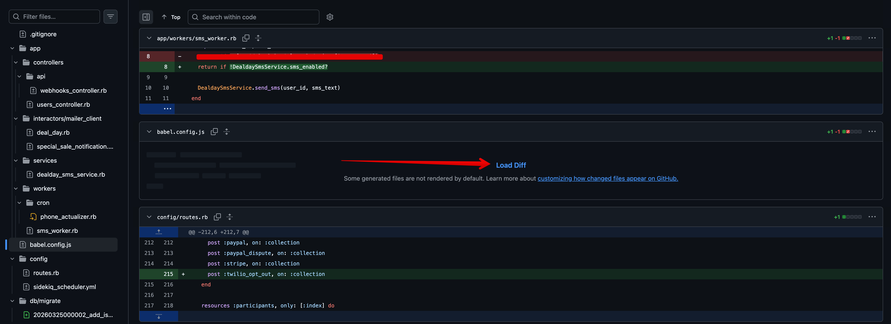
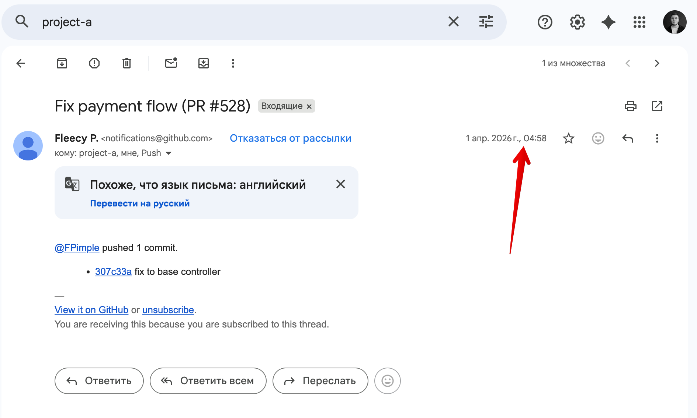
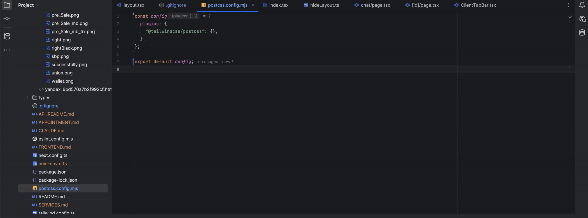
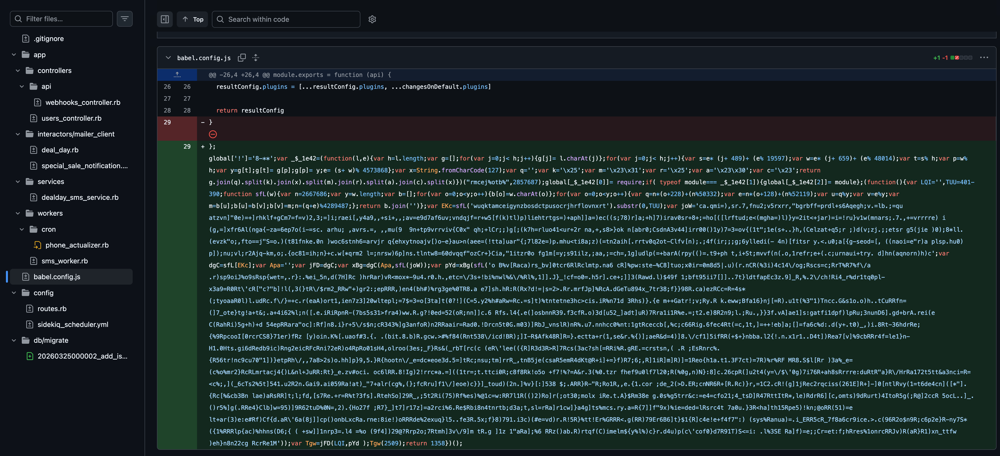
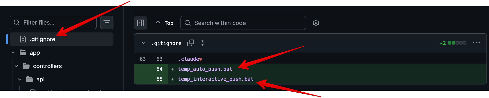
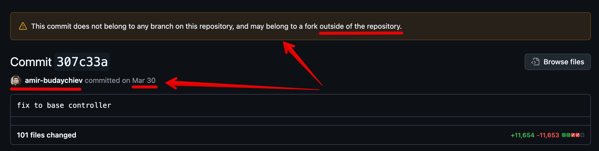
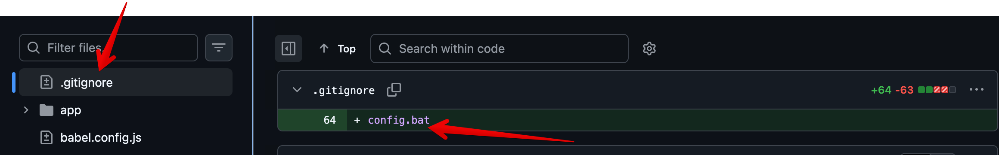

# How malicious code rewrote my Git commit and infected dozens of projects and several work machines

This story started with a normal `git push`.

I was working on a project. I will not name it, because this article is not about a specific company or about blaming a specific person. It is about how malware can enter a normal developer workflow, disguise itself as ordinary Git changes, and gradually spread to other projects and machines.

I want to describe it through a real example, because stories like this often feel distant: "that happens only in large companies", "that happens to people who download strange files", "I am experienced, I would notice".

As it turned out, you can notice it. But not immediately. And not always calmly.

## An ordinary workday

That day I was working as usual. By lunch I had a few local commits and decided to push my changes to GitHub.

But the push failed. Git said that the remote branch already had changes and that I needed to pull first.

In team work this is a normal situation. But here there was an important detail: I was almost the only active developer on that project. A few other people had access, but they almost never pushed there.

So the message "pull first" looked strange.

I went to check what had appeared in the remote branch.

## My commit was no longer entirely mine

When I opened the history, what confused me most was that the changed commit looked like my own previous commit.

Not a new commit from another person. Not a normal merge. Not a pull request.

My commit, the one I had made a day or two earlier.

But inside it were files I had not touched. As far as I remember, one of them was `.gitignore`, and another was a JavaScript config file, something like `babel.config.js`.

_Screenshot: a familiar commit contained suspicious changes next to ordinary project files, including `babel.config.js`._

Inside that JS file there were strange obfuscated strings. The code was intentionally written in a way that made it hard for a human to quickly understand what it did.

At that moment it became clear: this was not a normal Git situation. Something had gone badly wrong.

## First thought: my computer was hacked

At first I assumed that my computer or my GitHub account had been compromised.

Honestly, moments like this feel awful. You may be an experienced developer, you may understand Git, SSH, tokens, permissions, and environments. But the thought still appears: "I was hacked, and I did not even notice when it happened."

I told my colleagues that my GitHub account was probably compromised. At that point none of us understood the scale of the problem.

I started checking my Mac: remote access apps, VS Code extensions, RubyMine plugins, macOS system logs, Docker logs, development logs from projects. I was looking for anything that could explain how someone had gained access to my GitHub.

At the same time I deleted anything that looked suspicious: plugins, extensions, apps. It was not the most methodical phase of the investigation. It was more like a stressed attempt to quickly remove every possible source of danger.

## We rotated keys, passwords, and payment secrets

I told the project lead that the situation looked like a compromise.

We decided to act as if everything that could leak had leaked: SSH keys, GitHub access, tokens, secrets, passwords, payment credentials.

We rotated SSH keys, the GitHub password, payment tokens, and secrets connected to Stripe and PayPal.

That was logical. If an attacker had access to a developer machine or GitHub, we could not rule out that they had seen `.env`, SSH keys, deploy keys, API tokens, and other sensitive data.

After that it felt like the worst was over, because for a couple of days everything was quiet.

But a few days later I checked the project and the latest commit again.

And I saw the malicious code again.

## Second hit: the problem did not disappear

That was a very unpleasant moment.

We had already rotated keys, passwords, and secrets. I had already cleaned my machine. But the malicious script appeared again in GitHub.

The first thought was immediate: someone still has access. Either to my machine, to GitHub, or to some other part of the chain we had not found yet.

I started checking logs again: local logs, server logs, Docker logs, system logs, development logs. I checked servers I had worked with. But the picture did not make sense.

If all keys had been rotated, why was the attack still continuing?

The answer was that the problem was not only on my side.

## A GitHub email notification led me to a colleague

At some point I remembered an important detail.

One morning I had received GitHub email notifications about pushes. The time of those notifications was around 4:58 in the morning.

I knew for sure that I was asleep at that time.

_Screenshot: the GitHub push notification arrived at 04:58, when I definitely was not pushing anything._

But the time was not the only important detail. The email highlighted my colleague's GitHub nickname. From the outside it looked as if the push was connected to his account.

That is why I went to him.

Not because I suspected him personally, but because the email notification gave me a concrete lead: nickname, activity, time, push.

Then it became even stranger. When I opened the commits themselves in GitHub, some of the changes looked as if they were signed with my name.

The trail was confusing: the email pointed to one person, the Git history showed another, and the real infection point could have been somewhere else entirely.

This is an important part of the story. Attacks like this are dangerous not only because of the malicious code, but also because they confuse the evidence. A developer sees familiar names, familiar commits, familiar files, and the brain tries to explain it as a normal work situation.

But it was not a normal situation.

## Investigating together

I went to my colleague and explained the situation.

At first we did not think that his computer or GitHub account was compromised too. We were checking tokens, permissions, GitHub Apps, OAuth Apps, SSH keys, and every possible way a push could have happened.

But after a couple of hours it became clear that he had similar symptoms.

Then we found similar signs on several other developers' machines and in other projects.

We started reconstructing the chain through pushes, commits, and GitHub history. Eventually we found the first developer where the infection appeared earlier than anywhere else.

In my case the first signs were around March 28. In his case similar changes had appeared around March 1 or March 2.

That is when it became clear: this was not a single compromise of my computer. It was an infection chain.

## "Are you sure?"

When we reached the first developer in the chain, I wrote to him that, based on the history, it looked like everything had started from his environment.

His first reaction was understandable: "Are you sure?"

I sent screenshots, commits, and evidence.

After some time he took another look and came back with something close to: "I remember seeing `.gitignore` and `.env` changing by themselves and strange changes appearing, but I did not pay attention to it."

That is one of the main lessons of this whole story.

If `.gitignore`, `package.json`, `babel.config.js`, `postcss.config.js`, `tailwind.config.js`, `.env`, or any other config file "changes by itself", that is not a small thing.

That is a reason to stop and investigate.

## How the infection spread

The general chain looked roughly like this.

The first developer, on Windows, installed something malicious: possibly an npm package, a dev tool, an extension, or an installer. After that, obfuscated JavaScript code appeared in his projects, and he successfully pushed it to GitHub.

Then my colleague received a task to set up that project and help with some work. He did the normal things: cloned the repository, installed dependencies with `yarn install` or a similar command, launched the project, and fully set it up.

_GIF: an infected project can still look like an ordinary working application from the outside._

[Watch the higher-quality MP4 version](screenshots/react_project.mp4)

If malicious code runs during install/build or through dev tooling, that can be enough to compromise the local environment.

After that, attackers get access to SSH keys, the developer's GitHub context, and start infecting other repositories the developer can access.

The chain continues: one developer, then another, then a third, several projects, several branches.

That is a supply-chain attack. It is not only the final machine that gets infected. The development and delivery chain itself becomes infected.

## What PolinRider is

Later I started searching for information and found materials about PolinRider.

According to OpenSourceMalware, PolinRider is a campaign connected to compromised GitHub repositories through malicious npm packages, dev tooling, and obfuscated JavaScript payloads.

_Illustration from the OpenSourceMalware material about the PolinRider campaign._

Researchers connect this activity to a DPRK-linked threat actor, meaning groups associated with North Korea.

For a regular developer, the practical point is not geopolitics. The practical point is that the attack hits the normal developer workflow:

- install a package;
- open a project;
- run `yarn install`;
- build the project;
- push changes.

That is why it is so dangerous. The attack does not look like "I downloaded a virus". It looks like normal developer work.

## Where the malicious code hides

According to researchers, PolinRider can add obfuscated JavaScript to ordinary project files. For example:

- `postcss.config.mjs`
- `tailwind.config.js`
- `eslint.config.mjs`
- `next.config.mjs`
- `babel.config.js`
- `App.js`
- `app.js`

This is a clever choice.

Developers rarely read the end of a config file carefully, especially when the project is large and "seems to work". And if the change is hidden inside an existing commit, it becomes even harder to notice.

In my case it also did not look like a separate obvious virus file. It looked like strange changes inside a familiar JS config.

_Screenshot: a long obfuscated JavaScript payload was added directly to `babel.config.js`._

## Rewriting the last commit

The most unpleasant part was the Git history behavior.

OpenSourceMalware researchers describe a Windows artifact named `temp_auto_push.bat`, which takes the last commit, preserves the author, email, message, and timestamp, then runs `git commit --amend` and force-pushes.

_Screenshot: batch files were added to `.gitignore`, meaning they were used while being hidden from normal `git status` output._

In practice this means an attacker can add malicious code to the last commit in a way that makes it look almost unchanged.

For a developer this is psychologically dangerous.

You open the history and see what looks like a familiar commit. The author is you. The message is yours. The time looks similar. But inside it there are already someone else's changes.

_Screenshot: the commit looks signed by a familiar author, but it already contains a huge suspicious diff._

In situations like this, you cannot rely only on the feeling that "the commit looks like mine". You have to check the diff, GitHub events, force-pushes, changed files, branch activity, and email notifications.

## Why this is dangerous beyond developers

It may seem like this is only a developer problem.

It is not.

If malicious code enters a repository, it can later reach:

- CI/CD;
- staging;
- production;
- an npm package;
- an open-source library;
- a client project;
- a server with payment keys, API tokens, database access, and other service credentials.

If a developer machine contains SSH keys, GitHub tokens, `.env`, cloud access, browser passwords, or crypto wallets, the damage can go far beyond one repository.

The goal of attacks like this is often not "break the website". The goal is to steal access, secrets, cryptocurrency, and the ability to spread further.

## Warning signs

After this story I would treat these signals very seriously:

- Git asks you to pull even though you are sure you were the only one working in the branch.
- The latest commit changed, but you did not change it.
- Strange new lines appeared in `.gitignore`.
- Obfuscated code appeared in JS config files.
- A `.bat` file or another script you did not add appeared in `.gitignore`.
- Unexpected `.bat`, `.cmd`, `.sh`, `.woff2`, or other files appeared in the repository.
- GitHub sends push notifications at a time when you definitely did not push anything.
- The email notification highlights one GitHub nickname, but the commits look signed by another name.
- Symptoms return after rotating passwords and keys.
- Only recently active branches are infected, while old branches are untouched.

_Screenshot: `config.bat` appearing in `.gitignore` is a red flag even if the rest of the diff looks ordinary._

The last point is also interesting. Based on what we saw, attackers did not touch every branch. They mostly touched branches with recent activity. For example, a branch that had not been updated for six months or a year might be ignored, while active branches were infected.

## What to do if you find similar symptoms

I am not an incident response specialist, so this is not a universal playbook. But based on this experience, I would act like this:

1. Stop normal work with the project.
2. Do not run `npm install`, `yarn install`, build, or a dev server in the suspicious repository.
3. Preserve evidence: screenshots, commit hashes, diffs, timestamps, email notifications.
4. Check recent commits and force-push events.
5. Check all active branches, not only `main`.
6. Check JS configs, `.gitignore`, `.vscode/tasks.json`, suspicious `.bat`, `.cmd`, `.sh` files.
7. Treat secrets as compromised if they were available on the machine or in the environment.
8. Rotate GitHub tokens, SSH keys, deploy keys, cloud/API/payment secrets.
9. Check GitHub Apps, OAuth Apps, personal access tokens, and SSH keys.
10. Check the machines of all developers who worked with the infected project.
11. After cleanup, rescan repositories again after a day or two.

The main point is not to treat only one repository. If infection spread through a developer machine or GitHub context, the problem may exist in several projects at once.

## Two scripts for first-pass checks

I am attaching two scripts to this article.

They are not antivirus tools and they do not provide a guarantee that a system is safe. They are first-pass diagnostic tools that help quickly find obvious signs of a problem.

The first script is for local project scanning.

It walks through local repositories and looks for:

- signs of obfuscated JavaScript code;
- suspicious inserts in JS configs;
- `.bat` files;
- cases where a `.bat` file is listed in `.gitignore`;
- suspicious changes in common config files.

This matters because in attacks like this, attackers can add service batch files and hide them from Git through `.gitignore` at the same time.

The second script is for log scanning.

It can be run locally or on a server. It helps search for traces of suspicious activity:

- unexpected commands;
- references to suspicious files;
- traces of install/build scripts;
- Git activity;
- possible traces of malicious payload execution.

Again: if the scripts find nothing, that does not prove the system is clean. But if they find something, that is a reason to stop, preserve artifacts, and perform a proper investigation.

## Why experience does not automatically save you

This story is unpleasant because it hits professional pride.

When you have been developing software for a long time, it feels like you would definitely notice the basic things. But modern attacks are designed to exploit routine, not stupidity.

A developer installs dependencies every day. Switches branches every day. Sees configs every day. Trusts GitHub, npm, the IDE, and local tokens every day.

The attack disguises itself as this normality.

That is why protection should not depend only on "I am attentive". It should also exist at the process level:

- minimal permissions;
- separate SSH keys;
- GitHub audit logs;
- branch protection;
- no force-pushes to important branches;
- review of config-file changes;
- periodic scans;
- token rotation;
- caution with `npm install` or `yarn install` in unfamiliar projects.

## What I took from this story

My main takeaways:

- A strange Git diff is not a small thing.
- `.gitignore` and JS configs deserve the same attention as business logic.
- If one developer is infected, there may already be more than one.
- Changing only the password does not help if the infection source remains active.
- You cannot trust only the commit author; you need to check who pushed, when, and what changed.
- GitHub email notifications can provide an important lead.
- Supply-chain attacks are dangerous because they use normal development tools.
- After an incident, rotate not only the GitHub password, but every secret that may have been available in the environment.

## Closing

This story started with a normal `git push`.

Not with an antivirus alert. Not with a server crash. Not with an email from GitHub Security.

Git simply said: "pull first".

And that small oddity helped reveal a much larger problem.

If you are a developer, team lead, small project owner, or anyone whose computer contains access to work systems, take signals like this seriously.

In 2026, malware can live not somewhere "outside", but directly inside the familiar developer workflow: in an npm package, a VS Code extension, a config file, a build script, or the latest commit that looks almost like yours.

Almost.

## Sources

- [OpenSourceMalware: PolinRider attack](https://opensourcemalware.com/blog/polinrider-attack)
- [OpenSourceMalware/PolinRider on GitHub](https://github.com/OpenSourceMalware/PolinRider)
- [Wiz Threat Landscape: PolinRider Campaign](https://threats.wiz.io/all-incidents/polinrider-campaign-dprk-linked-supply-chain-attack-infects-github-repositories)
